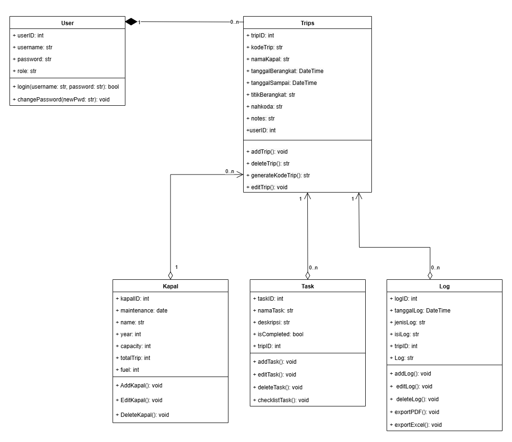
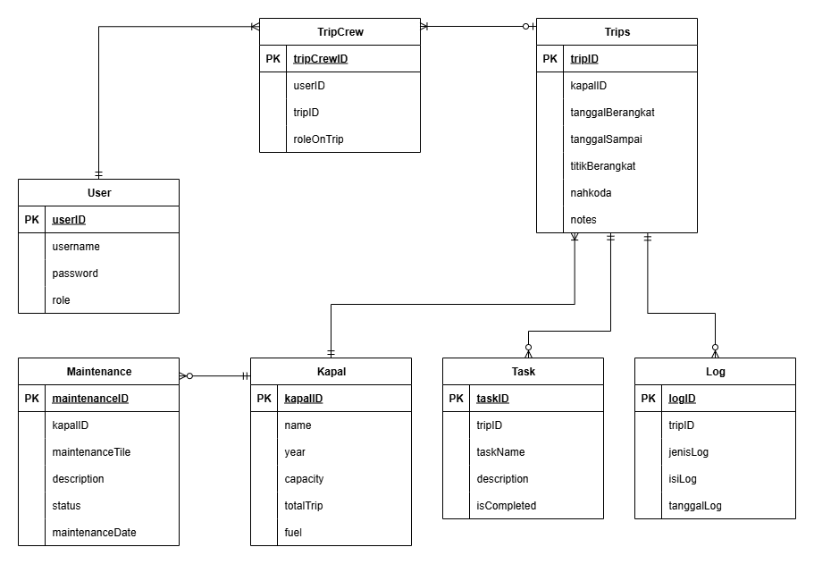

# SeaNote

Aplikasi desktop logbook digital yang memudahkan pencatatan perjalanan kapal, kru, bahan bakar, serta perawatan mesin.

`Kelompok junproZzZ`

- Ketua Kelompok: Warda Saniia Fawahaana - 23/518824/TK/57170
- Anggota 1: Aurellya Ratna Dewanti - 23/517176/TK/56870
- Anggota 2: Syifa Alifiya - 23/517440/TK/56918

## Desain Class Diagram


## Desain Entity Relationship Diagram <i>(Enhanced)</i>



# 🚢 SeaNote - Integrated Ship Management System

[](https://dotnet.microsoft.com/)
[](https://www.postgresql.org/)
[]()

**SeaNote** adalah aplikasi desktop logbook digital (Windows Forms) yang dirancang untuk memodernisasi pencatatan operasional kapal. Aplikasi ini menjadi solusi terpusat untuk memantau perjalanan kapal (*Trips*), pemeliharaan mesin (*Maintenance*), serta manajemen kru secara *real-time*, menggantikan sistem pencatatan manual yang tidak efisien.

---

## 🌟 Fitur Utama

Aplikasi ini menerapkan **Role-Based Access Control (RBAC)** dengan pembagian akses:

### 🛡️ Admin
* **User Management:** Mengelola akun pengguna (Engineer, Owner) dan hak akses.
* **Master Data Control:** Menambah dan mengedit data armada kapal dan jadwal perjalanan.
* **Global Monitoring:** Dashboard ringkasan total aset dan aktivitas sistem.

### 🔧 Engineer
* **Maintenance Tracker:** Melaporkan kerusakan dan memperbarui status perbaikan mesin (*Pending/Completed*).
* **Task Management:** Mengelola tugas harian operasional di lapangan.
* **Activity History:** Melihat riwayat pekerjaan maintenance yang telah diselesaikan.

### 💼 Owner
* **Executive Dashboard:** Memantau total armada, trip aktif, dan maintenance pending secara global.
* **Read-Only Access:** Akses data transparan tanpa risiko perubahan data yang tidak disengaja.
* **Activity Monitoring:** Memantau aktivitas terbaru yang dilakukan oleh Admin dan Engineer.

---

## 📸 Application Previews

Berikut adalah tampilan antarmuka aplikasi SeaNote:

### 0. Splash Screen
Tampilan awal yang menyambut pengguna dengan identitas visual modern saat aplikasi pertama kali dijalankan.
<div align="left">
  
</div>

### 1. Autentikasi & Keamanan
Aplikasi dilengkapi dengan sistem login yang membedakan hak akses (Admin, Engineer, Owner).
<div align="left">
  
</div>

### 2. Dashboard Monitoring (Admin)
Pusat kontrol untuk melihat ringkasan jumlah kapal, trip aktif, dan log aktivitas global.
<div align="left">
  
</div>

### 3. Manajemen Operasional (Trip & Ships)
Formulir input data yang valid dan terintegrasi langsung dengan database PostgreSQL.
<table>
  <tr>
    <td width="50%" align="left" valign="middle">
      
    </td>
    <td width="50%" align="center" valign="middle">
      
    </td>
  </tr>
</table>

### 4. Engineer Workspace
Dashboard khusus teknisi untuk memantau maintenance dan status perbaikan mesin.
<table>
  <tr>
    <td width="50%" align="left" valign="middle">
      
    </td>
    <td width="50%" align="center" valign="middle">
      
    </td>
  </tr>
</table>

---

## 🛠️ Tech Stack

Project ini dibangun menggunakan teknologi modern dan arsitektur yang solid:

| Komponen | Teknologi | Deskripsi |
| :--- | :--- | :--- |
| **Framework** | **.NET 9.0** | Versi terbaru .NET untuk performa maksimal. |
| **UI Framework** | **Windows Forms** | Antarmuka desktop yang responsif. |
| **Database** | **PostgreSQL** | Database relasional yang handal dan skalabel. |
| **Connectivity** | **Npgsql** | Data provider untuk menghubungkan C# dengan PostgreSQL. |
| **Security** | **Env Encryption** | Pengamanan kredensial database. |

---

## 🏛️ Desain Sistem (OOP)

Aplikasi ini menerapkan pilar **Object-Oriented Programming (OOP)** secara ketat:

1.  **Inheritance (Pewarisan):**
    * Seluruh Form mewarisi sifat dasar dari *base class* `Form`.
    * Model data menggunakan inheritance untuk entitas yang memiliki kesamaan atribut.
2.  **Encapsulation (Pembungkusan):**
    * Penggunaan *Access Modifier* (`private`, `public`, `protected`) untuk melindungi integritas data dalam class.
    * Logika bisnis dibungkus dalam method terpisah (e.g., `LoadRecentActivity()`).
3.  **Polymorphism (Banyak Bentuk):**
    * Penggunaan List generik untuk menampung objek turunan yang berbeda dalam satu proses pelaporan.

---

## 🚀 Instalasi & Penggunaan

### Prasyarat
* Visual Studio 2022.
* PostgreSQL Server (Lokal atau Cloud seperti NeonDB).

### Langkah Instalasi
1.  **Clone Repository**
    ```bash
    git clone [https://github.com/wrdsnf/SeaNote.git](https://github.com/wrdsnf/SeaNote.git)
    ```
2.  **Konfigurasi Database**
    * Buat database baru di PostgreSQL bernama `seanote_db`.
    * Import skema database dari file SQL yang tersedia (jika ada) atau sesuaikan dengan ERD.
    * Buka file `SeaNoteApp/DbHelper.cs`.
    * Sesuaikan string koneksi (`Host`, `Username`, `Password`) dengan database Anda.
3.  **Jalankan Aplikasi**
    * Buka file solution **`SeaNotea-proj.sln`** di Visual Studio 2022.
    * Di *Solution Explorer*, klik kanan project **`SeaNoteApp`** lalu pilih **"Set as Startup Project"**.
    * Tekan **F5** atau klik tombol **Start** untuk menjalankan aplikasi.

---

## 🔑 Akun Demo

Gunakan kredensial berikut untuk mencoba fitur berdasarkan role:

| Role | Username | Password |
| :--- | :--- | :--- |
| **Admin** | `admin` | `123` |
| **Engineer** | `cl` | `16` |
| **Owner** | `own` | `123` |

---

## 👥 Tim Pengembang (junproZzZ)

1. [**@aurellyak**](https://github.com/aurellyak) | **System Analyst & QA**
2. [**@cheepi**](https://github.com/cheepi) | **Full Stack Application Developer**
3. [**@wrdsnf**](https://github.com/wrdsnf) | **DevOps & Security Specialist** 

---

## 🧪 Status Pengujian

Aplikasi ini telah melalui proses **Black Box Testing** dengan hasil:
* **Total Skenario:** 30+ Skenario Uji.
* **Cakupan:** Login, CRUD Maintenance, Dashboard Real-time, Validasi Input.
* **Hasil:** ✅ **Passed (Semua fitur berjalan sesuai spesifikasi).**

---
*Dibuat untuk memenuhi tugas Junior Project - 2025.*
